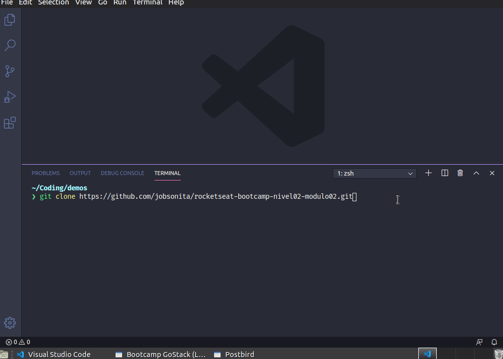

<p align="center"></p>

# Back-end em NodeJS

<p align="center">Autor: Jobson Gilberto Barros Amorim &lt;jobsonita@gmail.com&gt;</p>

Baseado nas aulas do curso [GoStack](https://rocketseat.com.br/gostack) (turma 11) da Rocketseat.

<p align="center"></p>

## Sobre este projeto

Este projeto demonstra as configurações básicas de um back-end em NodeJS usando as bibliotecas express, typescript e typeorm.

Este repositório contém a segunda parte das configurações do projeto. A primeira parte pode ser encontrada em [jobsonita/rocketseat-bootcamp-nivel02-modulo01](https://github.com/jobsonita/rocketseat-bootcamp-nivel02-modulo01).

Para maiores detalhes sobre o passo-a-passo da configuração do projeto, utilize a seção "Comandos utilizados na construção do projeto" deste readme em conjunto com o detalhamento dos [commits](https://github.com/jobsonita/rocketseat-bootcamp-nivel02-modulo02/commits/master) deste repositório.

Este projeto pode ser usado em conjunto com o front-end disponibilizado em [jobsonita/rocketseat-bootcamp-nivel03-modulo02](https://github.com/jobsonita/rocketseat-bootcamp-nivel03-modulo02).

## Dependências Globais

É necessário ter [Node](https://github.com/nvm-sh/nvm) e [Yarn](https://yarnpkg.com) instalados.

## Bibliotecas e ferramentas utilizadas

- express
- typescript
- eslint + prettier (padronização de código)
- typeorm (com PostgreSQL, biblioteca pg)
- jsonwebtoken (autenticação)
- multer (configurado para armazenamento local)
- [VS Code](https://code.visualstudio.com) (editor de código preferido)
- Docker (gerenciador de contêiners)
- Contêiner postgres (através do Docker)
- Postbird ou DBeaver (PostgreSQL GUI client)
- Insomnia (simulação de requisições HTTP REST)

## Instalação e execução

Com um terminal aberto na raiz do projeto, execute:

```
yarn
```

Após a instalação das bibliotecas, instale o Docker em sua máquina e crie uma réplica do contêiner postgres no docker:

```
docker run --name gostack_postgres -e POSTGRES_PASSWORD=your_password -p 5432:5432 -d postgres:11
```

O contêiner será ativado por padrão, mas confira usando a primeira linha abaixo e, se o contâiner não estiver ativo, execute a segunda linha para ativá-lo:

```
docker ps -a
docker start gostack_postgres
```

Após a criação do banco de dados, use um cliente sql de sua preferência (como Postbird ou DBeaver) para se conectar ao docker e crie um banco de dados chamado "gobarber". Em seguida, faça uma copia do arquivo .env.example com o nome .env e preencha os dados de conexão:

```
TYPEORM_CONNECTION = postgres
TYPEORM_HOST = localhost
TYPEORM_PORT = 5432
TYPEORM_USERNAME = postgres
TYPEORM_PASSWORD = your_password
TYPEORM_DATABASE = gobarber
TYPEORM_LOGGING = true
TYPEORM_ENTITIES_DIR = src/models
TYPEORM_MIGRATIONS_DIR = src/database/migrations
TYPEORM_ENTITIES = src/models/*.ts
TYPEORM_MIGRATIONS = src/database/migrations/*.ts
```

Com o terminal aberto na raiz do projeto, execute a migração das tabelas:

```
yarn typeorm migration:run
```

Finalmente, com um terminal aberto na raiz do projeto, execute:

```
yarn dev:server
```

Utilize uma ferramenta como o Insomnia para fazer requisições nas rotas descritas nos arquivos da pasta src/routes.

```
GET 'http://localhost:3333/appointments'
```

## Comandos utilizados na construção do projeto

Caso deseje criar um projeto do zero seguindo os passos dos commits, listo abaixo os comandos executados nesta segunda parte da configuração. Certifique-se de executar antes os passos do [projeto base](https://github.com/jobsonita/rocketseat-bootcamp-nivel02-modulo01) ou cloná-lo para usá-lo como base.

### Sessão 01

#### Aula 04

```
yarn add typeorm pg
```

#### Aula 05

```
yarn typeorm migration:create -n CreateAppointments
yarn typeorm migration:run
yarn typeorm migration:show
yarn typeorm migration:revert
yarn typeorm migration:run
```

#### Aula 06

Usei [definite assignment assertion](https://www.typescriptlang.org/docs/handbook/release-notes/typescript-2-7.html#definite-assignment-assertions) para não ser forçado a desativar a regra strictPropertyInitialization do typescript.

#### Aula 07

```
yarn add reflect-metadata
```

Devido a alterações na migration, é necessário recriar as tabelas:

```
yarn typeorm migration:revert
yarn typeorm migration:run
```

### Sessão 02

#### Aula 01

```
yarn typeorm migration:create -n CreateUsers
yarn typeorm entity:create -n User
```

Devido a alterações na migration de Appointments, é necessário recriar as tabelas:

```
yarn typeorm migration:revert
yarn typeorm migration:run
```

#### Aula 02

```
yarn typeorm migration:create -n AlterProviderFieldToProviderId
```

Devido a alterações nas migrations de Appointments e de Users, é necessário recriar as tabelas:

```
yarn typeorm migration:revert
yarn typeorm migration:revert
yarn typeorm migration:run
```

#### Aula 04

```
yarn add bcryptjs
yarn add @types/bcryptjs -D
```

### Sessão 03

#### Aula 03

```
yarn add jsonwebtoken
yarn add @types/jsonwebtoken -D
```

### Sessão 04

#### Aula 01

```
yarn typeorm migration:create -n AddAvatarFieldToUsers
yarn typeorm migration:run
yarn add multer
yarn add @types/multer -D
```

### Sessão 05

#### Aula 02

```
yarn add express-async-errors
```

## branch nivel03modulo02

### Sessão 02

#### Aula 01

```
yarn add cors
yarn add @types/cors -D
```

### Sessão 04

#### Aula 02

Retornando dados do usuário logado ao criar a sessão.
Estes dados serão usados no front-end.
